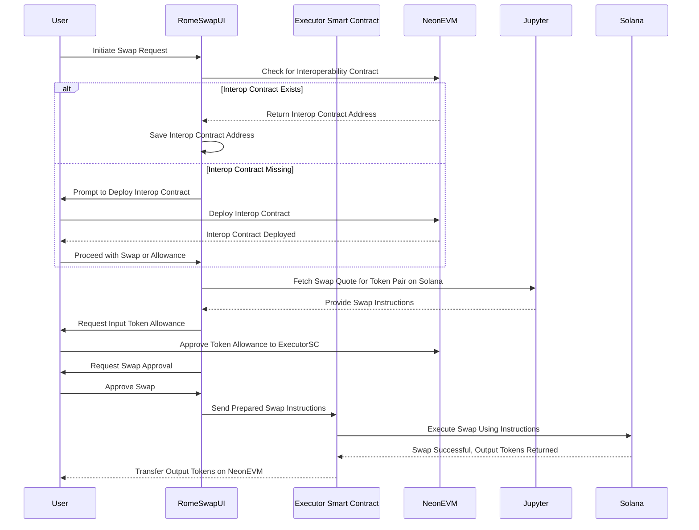

<center>
        <h1>🏛️ RomeSwap 🏛️</h1>
        <h2>🔓 Unlocking Solana Swaps for EVM Wallet Users</h2>
    
    <div>
        <a href="https://romeswap.com">🌐 https://romeswap.com</a>
    </div>
</center>

## Table of Contents 📑

<!--toc:start-->

- [🚀 Getting Started](#🚀-getting-started)
- [🔍 How It Works](#🔍-how-it-works)
  - [🛠️ Step-by-Step Process](#🛠️-step-by-step-process)
  - [🎥 Simplified Sequence Diagram](#🎥-simplified-sequence-diagram)
  - [🎯 Benefits](#🎯-benefits)
  <!--toc:end-->

## 🚀 Getting Started

First, run the development server:

```bash
npm run dev
```

Open [http://localhost:3000](http://localhost:3000) with your browser to see the result.

You can start editing the code. The page auto-updates as you edit the file.

## 🔍 How It Works

RomeSwap enables traders from EVM-compatible chains to execute swaps on the Solana blockchain directly from their existing EVM-only wallets like MetaMask. This seamless integration allows users to interact with Solana without needing a native Solana wallet.

### 🛠️ Step-by-Step Process

1. ✅ Token Verification: We first check if the Solana SPL output token has an interoperability contract deployed on NeonEVM.

   1. If there isn't such a contract the user has the choice to deploy it, making the Swap possible

2. 🗺️ Token Mapping: If an interoperability contract exists, we save its NeonEVM address to prepare the transaction.

3. 📊 Fetching Swap Quote: We obtain a swap quote from Jupyter for the desired token pair.

4. 🛡️ Approval: We get approval to transfer the input token on NeonEVM to the executor smartcontract.

5. ⚙️ Transaction Preparation: We prepare the transaction data based on the swap instructions received from Jupyter and the NeonEVM Addresses of the input and output token.

6. 🔄 Execute Swap: We send the previously prepared instruction data to the executor smart contract. Utilizing NeonEVM's composability feature, the contract executes the swap on Solana with the provided instructions.

7. 💸 Receive Output Tokens: After a successful swap, the user receives the output token on NeonEVM.

This entire procedure is trustless, decentralized, and requires no human intervention. The user experiences a seamless transaction, unaware that the Transactions are actually being executed on Solana.

### 🎥 Simplified Sequence Diagram



### 🎯 Benefits

- 🤝 Trustless and Decentralized: Eliminates the need for intermediaries or centralized exchanges.
- 🌐 Seamless User Experience: Users can perform swaps without realizing they are interacting with a different blockchain.
- 🔑 Expanded Access: EVM wallet users can access Solana's ecosystem without additional setup.
